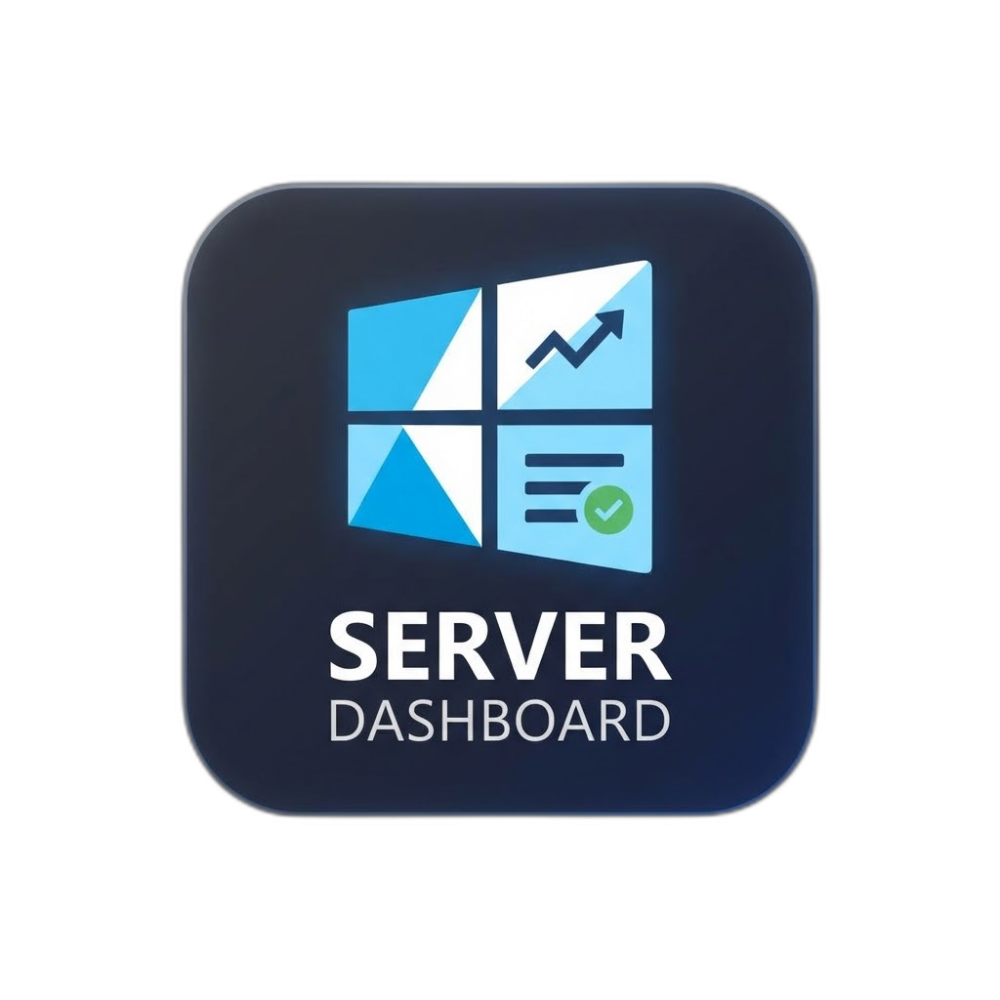
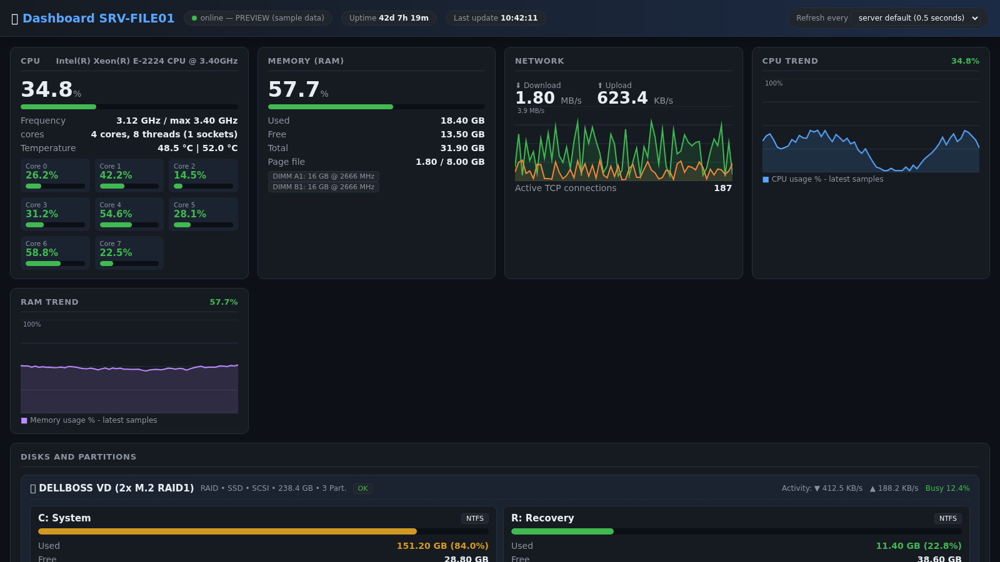
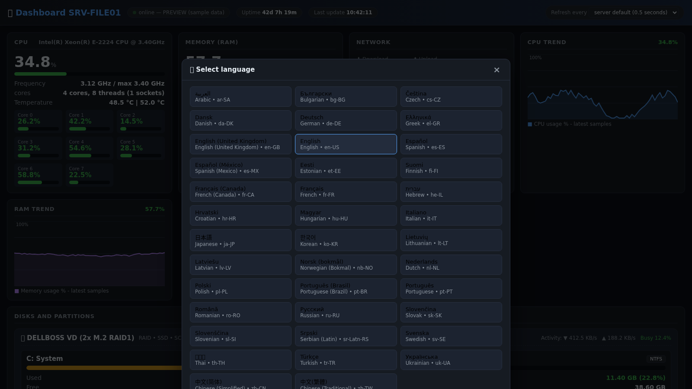
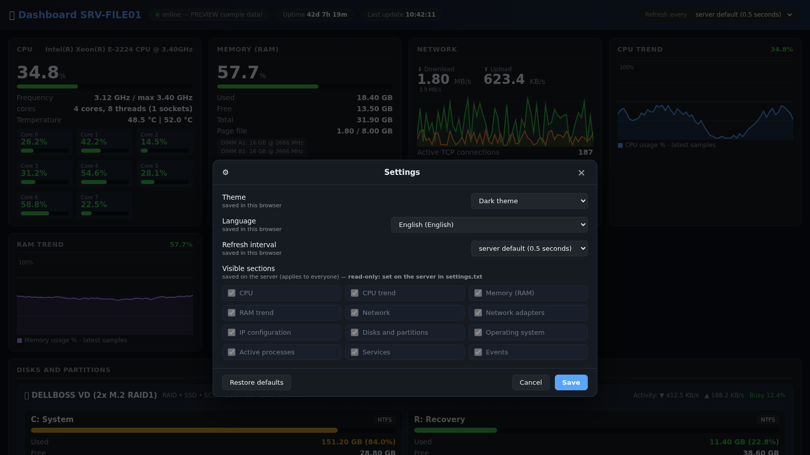

<div align="center">



# windows-server-dashboard

**A web dashboard for Windows Server that installs with one double click.**

No agent, no IIS, no external module, no database: a single PowerShell script
publishes the page, and you open it from any computer on the LAN by typing the
IP of the server.

[](Changelog/CHANGELOG.md)
[](#requirements)
[](#requirements)
[](#-38-languages)
[](LICENSE)



</div>

---

## Why

Every small server ends up with the same question: *what is it doing right now?*
The usual answers are a heavy monitoring suite, an agent to install and keep
updated, or Remote Desktop and Task Manager. This project is the boring middle
ground: copy a folder, run `Install.bat`, and from then on the machine publishes
its own status page on port 8080.

It runs as a scheduled task called **PiBOH Windows Server Dashboard**, under
`SYSTEM`, starting **at boot**: the server can sit at the lock screen forever,
nobody needs to log on. The task carries a description explaining what it is,
and the software announces itself in the Windows event log at every start.

## What it shows

| Section | Details |
|---|---|
| **CPU** | total load, per-core bars, real clock speed, socket/core/thread count, temperature, trend chart |
| **Memory** | used / free / total, page file, installed modules (slot, size, speed), trend chart |
| **Disks** | one box per physical disk with bus and media type, containing its partitions: space used, file system and live read / write / busy per partition |
| **Network** | live download and upload, history chart, per-adapter figures, link speed, MAC, active TCP connections |
| **IP configuration** | IPv4, mask, gateway, DNS, IPv6, DHCP, per adapter |
| **Operating system** | version and build, manufacturer, model, BIOS, serial, install date, last boot, uptime, sessions |
| **Processes** | every process with its real image name (`sqlservr.exe`) and, right under it, the friendly name from the file ("Task Manager" for `taskmgr.exe`); PID, CPU %, RAM, threads, handles, full path in the tooltip |
| **Services** | the complete list with state, startup type, PID and log-on account |
| **Events** | critical, error and warning entries of the System and Application logs of the last 24 hours |

Tables sort by clicking the column headers, File Explorer style, and the choice
is remembered by the browser.

## Quick start

```text
1. Copy the folder to the server, for example  C:\ServerDashboard\
2. Right-click Install.bat  ->  Run as administrator
3. From any PC on the LAN:  http://<server-ip>:8080
```

The installer checks the machine first, applies only what is missing and prints
every change with its **BEFORE** and **AFTER** value:

```text
 [+] Firewall rule "Server Dashboard 8080"
     BEFORE : not present  |  AFTER : created (inbound, TCP 8080)
 [=] URL reservation http://+:8080/
     BEFORE : already reserved  |  AFTER : unchanged
 [+] Scheduled task "ServerDashboard"
     BEFORE : not present  |  AFTER : created, runs at boot as SYSTEM

 [OK] AUTOSTART VERIFIED - no interactive logon needed
```

`Uninstall.bat` puts everything back exactly as it was, including a scheduled
task that happened to have the same name.

## Highlights

- **Zero dependencies** — `System.Net.HttpListener`, part of Windows. IIS is not
  installed and port 80 is left alone.
- **Light on the server** — metrics are sampled in tiers (CPU/RAM/network every
  cycle, processes every 5 s, disks every 10 s, services every 30 s, events every
  60 s) and **when nobody is watching the collector stops sampling completely**,
  waking up within 250 ms of the first request.
- **Live by default**: the refresh interval is **0.5 s** out of the box and can
  be set per browser from 0.5 s to 5 min; the server only sets the default.
- **Light and dark theme**, dark by default, saved per browser.
- **Works on any localized Windows** — every metric comes from CIM/WMI classes
  whose property names are always English.
- **Read-only by design** — the page only displays: no command can be executed.
  The server settings cannot be changed from the browser unless you set the
  optional password (`pwd` file): **total** closes the whole page behind a
  login, **partial** leaves the page open and locks only the server options,
  editable from the dashboard after typing the password.

## 🌐 38 languages

The interface is translated into every language Windows Server 2016 ships as a
display language. It opens in the language of Windows, and each visitor can pick
another one from the footer; the choice is personal and saved in their browser.

<div align="center"></div>

```text
ar-SA  bg-BG  cs-CZ  da-DK  de-DE  el-GR  en-GB  en-US  es-ES  es-MX  et-EE
fi-FI  fr-CA  fr-FR  he-IL  hr-HR  hu-HU  it-IT  ja-JP  ko-KR  lt-LT  lv-LV
nb-NO  nl-NL  pl-PL  pt-BR  pt-PT  ro-RO  ru-RU  sk-SK  sl-SI  sr-Latn-RS
sv-SE  th-TH  tr-TR  uk-UA  zh-CN  zh-TW
```

Arabic and Hebrew switch the layout to right-to-left. Adding a language means
copying one XML file into `lang\` and translating the strings: it shows up in the
picker by itself.

## Settings

<div align="center"></div>

| Option | Stored where | Who can change it |
|---|---|---|
| Theme | browser cache | every visitor |
| Language | browser cache | every visitor |
| Refresh interval | browser cache | every visitor |
| Default interval (0.5 s) | `settings.txt` | only on the server |
| Visible sections | `settings.txt` | only on the server |
| Logging on/off | `settings.txt` | only on the server |

`settings.txt` is a plain text file you edit with Notepad; changes are picked up
within ten seconds, no restart needed. The API that serves it accepts `GET` only
and answers `403` to any write attempt, so a visitor can never reconfigure the
server.

## Layout

```text
windows-server-dashboard\
├── Install.bat            install and start (as administrator)
├── Uninstall.bat          undo exactly what the installer changed
├── Start-Dashboard.bat    manual start, installs nothing
├── Stop-Dashboard.bat     stop it
├── settings.txt           server settings (auto-created, editable with Notepad)
├── scripts\               the engine, the updater and the helper scripts
│   └── version.txt        the version: the single source of truth
├── lang\                  the 38 translations
├── screenshots\           the images used by this page
├── Changelog\             CHANGELOG.md + release-notes\ (one file per release)
├── docs\                  manual, logo, offline preview
└── logs\                  one log file per day (auto-created)
```

## Self update

At every start - the scheduled task runs at boot as SYSTEM, so **no logon is
needed** - the dashboard reads
[`scripts/version.txt`](scripts/version.txt) from the `main` branch of this
repository. When the remote version is newer it downloads the release tagged
`v<version>`, unpacks it and copies it over the current files, **never
touching `settings.txt` or the logs**, then restarts itself on the new version.
Everything is written to the log, and to the Windows event log under the source
*PiBOH Windows Server Dashboard*.

```text
auto_update = no        in settings.txt  -> disable it
scripts\Update-Now.bat                   -> check, stop, update, restart
```

Because of this mechanism, releases must always be tagged `v<version>`
(for example `v1.16.0`).

## Try it without a server

Open **[`docs/Dashboard-Preview.html`](docs/Dashboard-Preview.html)** in any
browser: it is the real interface filled with sample data, all 38 languages and
both themes included. Nothing is installed and no network is used.

## Requirements

- Windows Server 2016 or newer (works on Windows 10/11 too)
- PowerShell 5.1, the one already in the box
- Administrator rights for the installation only
- CPU temperature needs a sensor: BIOS/ACPI, or just
  [Core Temp](https://www.alcpu.com/CoreTemp/) running (the plain program, 32-bit or
  64-bit - no add-on), LibreHardwareMonitor or HWiNFO

## Troubleshooting

Run **`scripts\Diagnose.bat`** as administrator: it changes nothing and reports
the state of the scheduled task, whether the process runs and under which
account, what is listening on the port, the URL reservation, the firewall rule,
how the disks were detected and the last lines of the log, ending with a verdict:

```text
>>> STARTS WITHOUT INTERACTIVE LOGON : YES
```

If it says `NO`, `scripts\Repair-Autostart.bat` rebuilds the task and the URL
reservation without reinstalling.

## Documentation

- [Manual](docs/README.md) — every option explained, in ten short chapters
- [Changelog](Changelog/CHANGELOG.md) — Semantic Versioning, from 1.0.0 to today

## Security note

The dashboard has no authentication: anyone who can reach port 8080 sees the
data. It is read only and no command can be run through it, but if the server is
exposed to the Internet restrict the rule to your subnet:

```bat
netsh advfirewall firewall set rule name="Server Dashboard 8080" ^
      new remoteip=192.168.1.0/24
```

## License

[MIT](LICENSE) — do what you like with it, a mention is appreciated.
